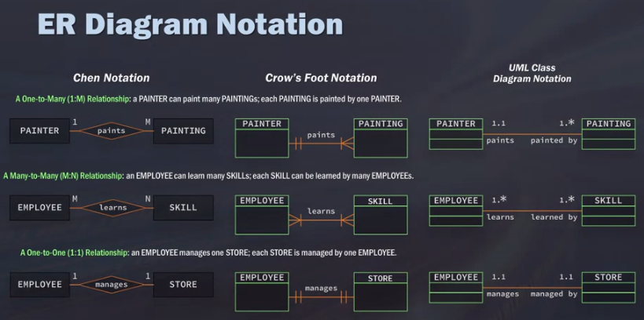
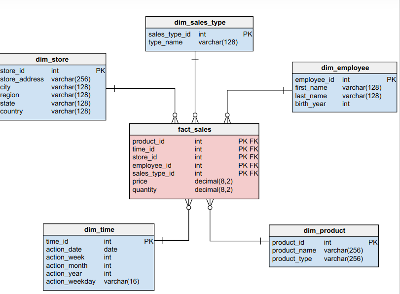
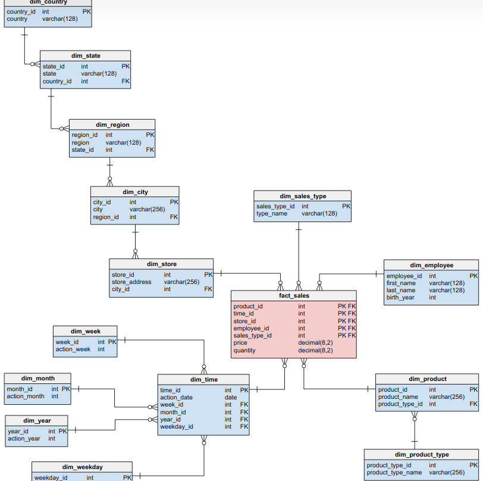

# About

These are my notes and exercises for the [SQL for data science](https://www.coursera.org/learn/sql-for-data-science) course by coursera.


## Week 1

### Getting started

- SQL = Structured Query Language
- mainly used for reading, writing and updating data

### Data models

- relational vs transactional database model
  - transational = think of simple process logs in a database
  - relational = very structured
    - RDBMS = relational database management system
- data model building blocks
  - entity = person, place
  - attribute = characterist of entity (e.g. age, country)
  - relationship = 
    - one-to-many = customer to invoice
    - many-to-many = student to class
    - one-to-one = store to manager
  - ER diagram = entity-relationship diagram
  - ER diagram has different notations
    - Chen notation
    - Crow's foot notation
    - UML class diagram notation
    - 
- you can join tables using
  - primary key = column whose value uniquely identifies every row
  - foreign key = one or more columns together identify a row


### Retrieving data with SELECT

- `SELECT prod_name FROM Products` returns `prod_name: Shampoo, ...`
- `SELECT prod_name, prod_id, prod_price FROM Products`
- `SELECT * FROM Products` returns all columns
- `SELECT <column> FROM <table> LIMIT <num_records>` limits to a number of rows
  -  `LIMIT` in Sqlite = `WHERE ROWNUM` in Oracle = `FETCH FIRST 5 ROWS ONLY` in DB2

### Creating tables

```sqlite
CREATE TABLE Shoes
( 
    Id char(10) PRIMARY_KEY,
    Brand char(10) NOT NULL,
    Price decimal(8,2) NOT NULL,
    Desc Varchar (750) NULL
);
```

- `NULL / NOT NULL` = whether column accepts empty cells. Primary keys do not accept NULL values

```sqlite
INSERT INTO Shoes VALUES ('14535974' 'Gucci', '695.00', NULL);

-- better be more specific
INSERT INTO Shoes
(Id, Brand, Price, Desc)
VALUES
('14535974' 'Gucci', '695.00', NULL);
```

### Creating *temporary* tables

- Why?
  - useful for testing
  - faster than creating a real table
  - temporary tables will be deleted once session terminates

```sqlite
CREATE TEMPORARY TABLE Sandas AS
(
    SELECT *
    FROM Shoes
    WHERE shoe_type = 'sandals'
)
```


### Comments

```sqlite
-- comment a single line
/* this is a
multiline 
*/
```

### Reading

#### Star schema vs Snowflake Schema 

from https://www.vertabelo.com/blog/data-warehouse-modeling-star-schema-vs-snowflake-schema/

Star schema: 

Snowflake schema: 




Snowflake schemas...

- ... will use less space (less redundancy)
- ... will be preferred by experienced data modelers
- ... result in longer / more complex queries (and thereby also slower!)

Conclusion:

- Use snowflake schema in data warehouse (save spacing is important!)
- use star schema in data marts (subset of central data warehouse)

#### SQL vs NoSQL

from https://dataconomy.com/2014/07/sql-vs-nosql-need-know/

NoSQL...

- actually comprises many different data storage models
- schemas are dynamic
- can more easily scaled across servers (for SQL *usually* 1 RDBMS = 1 Server?)
- may violate ACID compliancy (Atomicity, Consistency, Isolation, Durability)

Example NoSQL databases are:

- Document databases (e.g. MongoDB)
- Key-Value-stores
- Graph databases