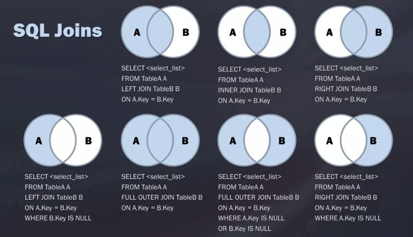

# Week 3

### Using Subqueries

Subqueries... 

- are queries inside another query
- are useful for filtering before merging with other tables

```sqlite
-- Example: Get information from customers with orders above 100kg:
SELECT CustomerID, CompanyName, Region
FROM Customers
WHERE CustomerID in (SELECT CustomerID FROM Orders WHERE Freight > 100);

-- Note: SQL performs the inner query first
```

Subqueries...

- can only select a single column
- can be nested infinitely (although performance degrades with nesting and maybe JOIN should be preferred)
- should be indented for easier reading

```sqlite
SELECT customer_name, customer_state
, (SELECT COUNT(*) AS num_orders FROM Orders
   WHERE Orders.customer_id = Customer.customer_id -- customers.?!
  ) AS num_orders -- not groupby?
FROM customers
```

### JOINing tables

JOINs...

- associate records from different tables.
- do not create new tables. The *intermediate* table only persist for the duration of the query.
- have different kinds  (see below)

#### Cartesian JOIN

- = matches each row from first table to all rows from second table
- num_rows_joined_table = num_rows_table1 **times** num_rows_table2 (multiplicative, therefore computationally expensive)!
- can yield incorrect results due to simple multiplication of tables (?)
- is not frequently used

```sqlite
SELECT product_name, unit_price, company_name
FROM suppliers
CROSS JOIN products;
```

#### Inner JOIN

- most frequently used
- selects records that have matching values in both tables
- can also be used on multiple tables
- are still computationally taxing, so only JOIN when necessary

```sqlite
SELECT suppliers.CompanyName, ProductName, UnitPrice
FROM Suppliers
INNER JOIN Products ON Suppliers.supplierid = Products.supplierid
-- Note: suppliers.CompanyName is called "prequalifying". This is necessary if the column name exists in both tables. If not specified, error "ambiguous column name"

SELECT o.OrderID, c.CompanyName, e.Lastname
FROM (
    (Orders o INNER JOIN Customers c ON o.customerID = c.CustomerID)
    INNER JOIN Employees e ON o.EmployeeID = e.EmployeeID
)
```

#### Aliases and Self JOINs

Example of an alias

```sqlite
SELECT column_name FROM table_name AS alias_name
```

Self joins require aliases

```sqlite
-- This "matches" customers from the same city ?!
SELECT A.CustomerName, B.CustomerName, A.City
FROM Customers A, Customers B
WHERE A.CustomerID=B.CustomerID AND A.City=B.City
```

#### Left, Right, Full Outer JOIN

- SQLite only supports Left JOIN, but other DBMS usually support all joins
- Every RIGHT join can be turned to a LEFT join by reversing order of tables	

```sqlite
-- LEFT join
-- = returns all records from table1 and only matched records from table2
SELECT C.CustomerName, O.OrderID
FROM Customers C
LEFT JOIN Orders O ON C.CustomerID = O.CustomerID

-- Full Outer join
-- = returns all records when there is a match in either table1 or table2
FULL OUTER JOIN Orders O ON C.CustomerID = O.CustomerID
```

### Unions

- usually rarely used, but useful in these instances
- = vertical stacking of tables, therefore needs same columns (number, dtype (,name?))

```sqlite
-- In which German cities do we have either suppliers or customers?
SELECT City, Country
FROM Customers
WHERE Country='Germany'
UNION 
SELECT City, Country
FROM Suppliers
WHERE Country='Germany'
```

### Summary

- Check results!
  - check that number of rows is expected (especially for Cartesian JOIN)
  - check for duplicates
  - --> Maybe do some leetcode questions to run into common problems



## Practice Quiz


```sqlite
-- Create a list of album titles and the unit prices for the artist "Audioslave".
SELECT albums.Title, tracks.UnitPrice, tracks.Name, artists.Name
FROM albums
INNER JOIN tracks ON tracks.Albumid=albums.Albumid
INNER JOIN artists ON artists.ArtistID=albums.ArtistID
WHERE artists.Name="Audioslave"

-- Are there any customers without an invoice?
SELECT c.Customerid, COUNT(i.Invoiceid) as cnt
FROM customers c
LEFT JOIN invoices i ON i.Customerid=c.Customerid
GROUP BY c.Customerid
ORDER BY cnt ASC

-- Find the total price for the album "Big Ones"
SELECT SUM(t.UnitPrice), a.Title
FROM albums a
INNER JOIN tracks t ON t.Albumid=a.Albumid
WHERE a.Title="Big Ones"
GROUP BY a.Title
```


## Reading

from https://mode.com/blog/learning-python-sql/ 

- different mindsets each language enforces - python vs SQL vs R 
- SQL has a limited set of clauses while python offers many way due to the libraries
- A very long SQL query are often only a few lines in python

## Module 3 Coding Assignment


