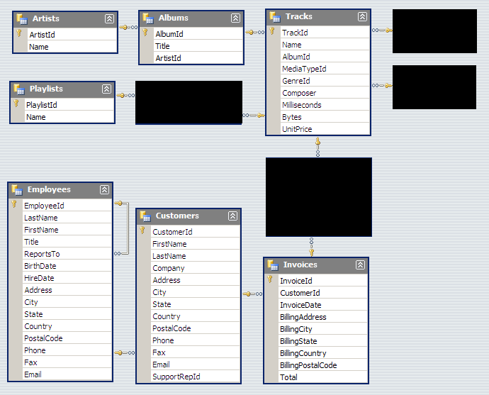

# Week 4

### Working with text strings

If possible, perform string conversion on server (due to higher speed?)

#### Concatenate

```sqlite
-- || is called pipe, equivalent to python + for strings
-- SQL server also supports + operator
SELECT CompanyName, ContactName, CompanyName || ' (' || ContactName|| ')'
FROM Customers
```

#### TRIM

- trims the leading or trailing space from a string
- also available as LTRIM (left / leading) and RTRIM (right / tRailing)

```sqlite
SELECT TRIM("   You the best    ") AS TrimmedString;
```

#### Substring

- extracts substring

```sqlite
-- SUBSTR(string_name, idx_start [one_indexed!], maximal_length [OPTIONAL!])
SELECT first_name SUBSTR(first_name, 1, 3) -- gets first three characters
FROM employees
```

#### Upper and lower

- `UPPER` for upper case (also `UCASE`)
- `LOWER` for lower case

```sqlite
SELECT UPPER(column_name)
FROM table_name
```

### Date and time strings

- each DBMS uses it's own variety of datatypes for dates. Examples
  - Wednesday, September 17th, 2008
  - 9/17/2008 5:14:56 P.M. EST
  - 9/17/2008 19:14:56 GMT
  - 2612008 (Julian Format)
- SQLite supports...
  - five date and time functions
    - DATE(timestring, ...)
    - TIME(timestring, ...)
    - DATETIME(timestring, ...)
    - JULIANDAY(timestring, ...)
    - STRFTIME(format, timestring, ...)  - string format time
  - additional modifiers such as
    - start of year / month day
    - NNN days (?!)
  - the following timestrings
    - YYYY-MM-DD
    - YYYY-MM-DD HH:MM
    - YYYY-MM-DD HH:MM:SS
    - YYYY-MM-DD HH:MM:SS.SSS
    - YYYY-MM-DDTHH:MM
    - YYYY-MM-DDTHH:MM:SS
    - YYYY-MM-DDTHH:MM:SS.SSS
    - HH:MM
    - HH:MM:SS
    - HH:MM:SS.SSS


```sqlite
-- Extract year, month, date from birthdate
SELECT Birthdate
, STRFTIME('%Y', Birthdate) AS Year
, STRFTIME('%m', Birthdate) AS Month
, STRFTIME('%d', Birthdate) AS Day
, Date(('now') - Birthdate) AS Age -- years as integer (not date?!)
FROM employees
```

```sqlite
-- get current datetime
SELECT DATE('now')

-- or get current date of current datetime
SELECT STRFTIME('%Y %m %d', 'now')
```

### Case statements

- mimics if-than-else statement
- can be used in SELECT, INSERT, UPDATE, DELETE

```sqlite
-- general
CASE
WHEN C1 THEN E1
WHEN C2 THEN E2
ELSE [result]
END

-- concrete
SELECT employerid
, city
, CASE City
WHEN 'Calgary' THEN 'Calgary'
ELSE 'Other'
END new_column_name
FROM Employees;

-- concrete with multiple WHEN's
SELECT trackid
, bytes
, CASE
WHEN bytes < 3 THEN 'small'
WHEN bytes >= 3 AND bytes < 5 THEN 'medium'
WHEN bytes >= 5 THEN 'large'
ELSE 'other'
END bytes_category
FROM tracks;
```

### Views

- creates an illusion of a stored query?
- temporary table will be removed after database connection has ended
- used to encapsulate queries
- is effectively a stored query

```sqlite
-- general
CREATE [Temp]
VIEW [IF NOT EXISTS] view_name(column-name-list)
AS select_statement

-- concrete (note: also shows nested INNER join :) !!! )
CREATE VIEW my_view AS
SELECT r.regiondescription, t.territorydescription, e.LastName
FROM Region r
INNER JOIN Territories t ON t.regionid=r.regionid
INNER JOIN Emploeeterritories et on et.TerritoriyID = t.TerritoryID
INNER JOIN Employees e on e.EmployeeID = et.employeeid

-- to view data use as a normal table
SELECT *
FROM my_view

-- to delete view
DROP VIEW my_view
```

### Data governance and profiling

Profiling...

- ... NOT in the sense of measuring computational speed
- ... rather gathering descriptive statistics such as
  - number of distinct values
  - number of rows with NULL values
- is very helpful for catching errors

Governance best practices:

- clean up your environments
- understand your promotion process (?)

### Using SQL for data science

It is important to...

- understand data (NULL values, string values, relations) !!!
- understand business domain / subject area
- be aware of the "unspoken need"
  - Example goal: We want to predict the probability of a customer buying our product"
  - Unspoken: which customers? what product? What time horizon?

More tips

- start small and go step-by-step
- test after each join or filter
- work stepwise from inner JOINs to outer ones
- use correct formatting and comments as necessary

## Reading

For training SQL queries

- https://blog.sqlauthority.com/category/sql-puzzle/
- https://sqlzoo.net/wiki/SQL_Tutorial - used often in interviews

## Coding questions



## Final assignment


Consists of two parts:

- In the first part, answer existing questions (graded on how easy code is to read)
- In the second part, come up with own questions and answer those

How to submit

- use SQL Lookup from coursera
- fill out TXT template with code and answers
- upload TXT template

#### Some learnings

from https://docs.microsoft.com/en-us/sql/relational-databases/tables/primary-and-foreign-key-constraints?view=sql-server-ver15

- primary key can be a composite, i.e. of multiple columns
- foreign key is used to establish a link between two tables